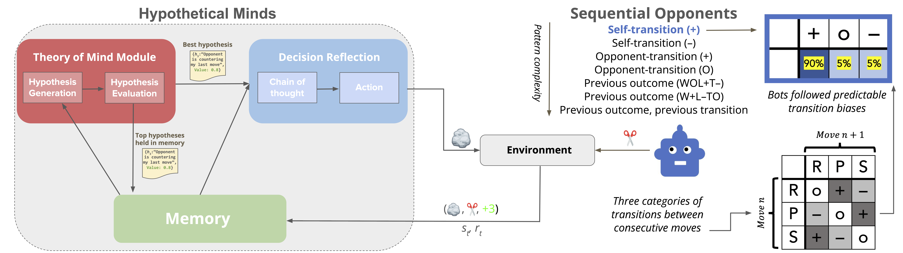

# Understanding Human Limits in Pattern Recognition: </br>A Computational Model of Sequential Reasoning in Rock, Paper, Scissors

**Logan Cross\*, Erik Brockbank\*, Tobias Gerstenberg, Judith E. Fan, Daniel L. K. Yamins, & Nick Haber**

To be presented at the *8th Annual Conference on Cognitive Computational Neuroscience* (2025; Amsterdam, Netherlands).

**[LINK TO PAPER](writeup/preprint.pdf)**

```
@inproceedings{cross2025understanding,
  title = {Understanding Human Limits in Pattern Recognition: A Computational Model of Sequential Reasoning in Rock, Paper, Scissors},
  booktitle = {Proceedings of the 8th Annual Conference on Cognitive Computational Neuroscience},
  author = {Cross*, Logan and Brockbank*, Erik and Gerstenberg, Tobias and Fan, Judith E. and Yamins, Daniel L. K. and Haber, Nick},
  year = {2025},
}
```


**Contents:**

* [Overview](#overview)
* [Repository structure](#repository-structure)
* [Human data](#human-data)
* [Model results](#model-results)
* [CRediT author statement](#credit-author-statement)


## Overview

<p text-align="center" style="font-size: smaller">
  </img>
</p>

How do we predict others from patterns in their behavior and what are the computational constraints that limit this ability? We investigate these questions by modeling human behavior over repeated games of rock, paper, scissors from Brockbank & Vul (2024). Against algorithmic opponents that varied in strategic sophistication, people readily exploit simple transition patterns (e.g., consistently playing rock after paper) but struggle to detect more complex sequential dependencies. To understand the cognitive mechanisms underlying these abilities and their limitations, we deploy Hypothetical Minds (HM), a large language model-based agent that generates and tests hypotheses about opponent strategies, as a cognitive model of this behavior (Cross et al., 2024). We show that when applied to the same experimental conditions, HM closely mirrors human performance patterns, succeeding and failing in similar ways. To better understand the source of HM's failures and whether people might face similar cognitive bottlenecks in this context, we performed a series of ablations and augmentations targeting different components of the system. When provided with natural language descriptions of the opponents' strategies, HM successfully exploited 6/7 bot opponents with win rates >80% suggesting that accurate hypothesis generation is the primary cognitive bottleneck in this task. Further, by systematically manipulating the model's hypotheses through pedagogically-inspired interventions, we find that the model substantially updates its causal understanding of opponent behavior, revealing how model-based analyses can produce testable hypotheses about human cognition.


## Repository structure

```
├── analysis
├── data
│   ├── human_data
│   │   └── data_processed
│   └── model_data
├── model
├── results
│   ├── figures
│   └── schematics
└── writeup
```

- `/analysis`: This folder contains the code for analyses presented in the paper (`rps_human_data_processing.R` generates processed data objects; `ccn_analyses.R` includes all figures and statistical analyses); figures generated in these analyses are saved the `/results/figures` (see below)
- `/data`: This folder contains data used for all analyses in the paper
    - `/human_data`: Raw CSV files as well as processed CSV and RData files in the `/data_processed` directory
    - `/model_data`: CSV file summarizing HM model performance
- `/model`: This folder contains the code for the HM model version used to generate the current results
- `/results`: This folder contains the figures generated by analysis scripts in `/analysis`, as well as schematic figures included in the manuscript
    - `/figures`: PDFs of figures generated by the analysis scripts in `/analysis`
    - `/schematics`: PDFs of schematics included in the manuscript
- `/writeup`: Preprint PDF


## Human data

The results reported here analyze human data for $N$=218 online participants playing 300 rounds of rock, paper, scissors against seven algorithmic bot opponents of varying complexity.
The human data was originally collected and reported in [Brockbank & Vul, 2024](https://www.sciencedirect.com/science/article/pii/S0010028524000252) and is used here with the authors' permission.
The raw human response data is stored in this repository in `/data/human_data`; however, the results reported in the manuscript analyze the *processed* data in `/data/human_data/data_processed`.

To replicate the analyses reported in the manuscript, first run the data processing script `/analysis/rps_human_data_processing.R`, which will generate processed CSV and RData files.
Next, run the analysis script `/analysis/ccn_analyses.R`, which will run all analyses and generate raw figures used in the manuscript (PDFs are saved in `/results/figures`).


## Model results

The manuscript also includes model results for a language-model based computational model of pattern learning paired with the same algorithmic bot opponents as humans in the human data.
The model is a modified version of the "Hypothetical Minds" model first reported in [Cross, Xiang, Bhatia, Yamins, & Haber, 2024](https://arxiv.org/pdf/2407.07086).

Model code can be found in the `/model` directory&mdash;model results produced by this code and analyzed in the current manuscript are in `/data/model_data`.


## CRediT author statement

*[What is a CRediT author statement?](https://www.elsevier.com/researcher/author/policies-and-guidelines/credit-author-statement)*

- **Logan Cross\***: Conceptualization, Methodology, Software, Validation, Formal analysis, Investigation, Data Curation, Writing - Original Draft, Writing - Review &amp; Editing, Visualization, Project administration
- **Erik Brockbank\***: Conceptualization, Methodology, Software, Validation, Formal analysis, Investigation, Data Curation, Writing - Original Draft, Writing - Review &amp; Editing, Visualization, Project administration
- **Tobias Gerstenberg**: Conceptualization, Methodology, Resources, Writing - Review &amp; Editing, Supervision, Project administration, Funding acquisition
- **Judith E. Fan**: Conceptualization, Methodology, Resources, Writing - Review &amp; Editing, Supervision, Project administration, Funding acquisition
- **Daniel L. K. Yamins**: Conceptualization, Methodology, Resources, Writing - Review &amp; Editing, Supervision, Project administration, Funding acquisition
- **Nick Haber**: Conceptualization, Methodology, Resources, Writing - Review &amp; Editing, Supervision, Project administration, Funding acquisition